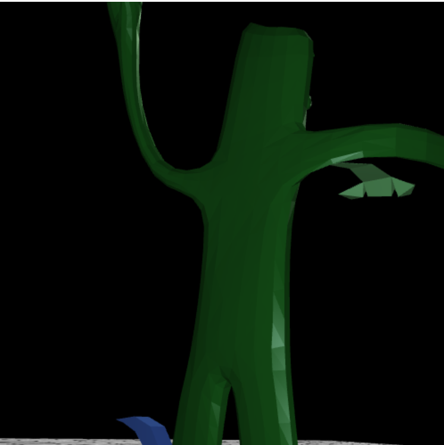
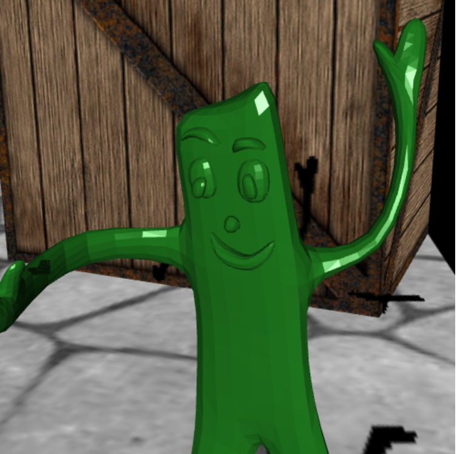
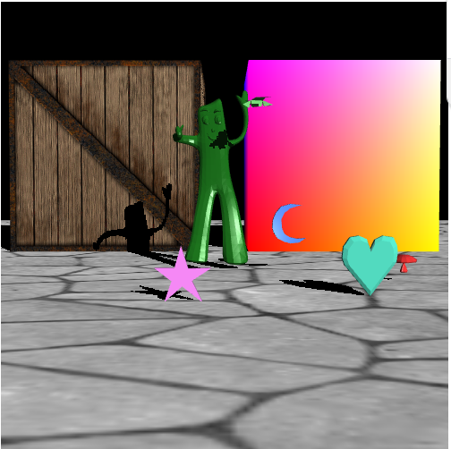
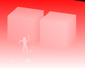
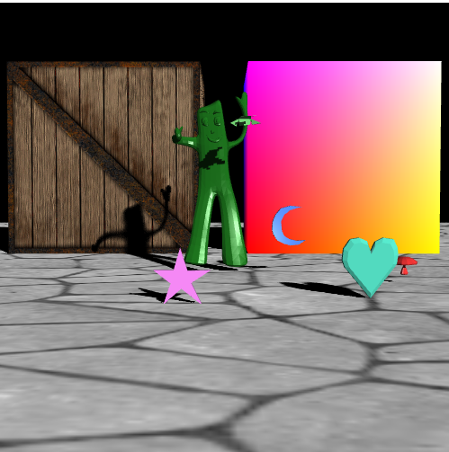
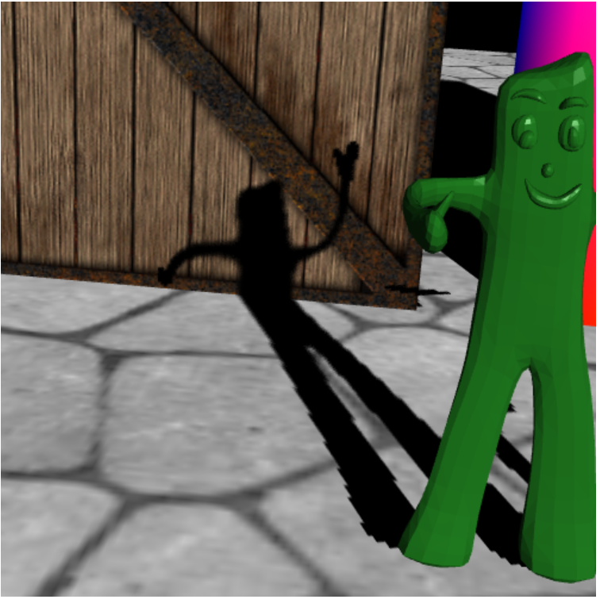

# Project3 项目文档

刘扬 21307110206

## 项目目录和文件说明

## 开发和运行环境

- 开发环境：Windows 11
- 开发工具：Visual Studio Code
- 运行环境：Chrome浏览器

## 运行和使用方法

运行VScode的Live Server插件并在浏览器中打开3DWalker.html即可看到场景效果。

1. 相机控制
    键盘交互：
    按A/D键来控制摄像机左右移动，按W/S键来控制摄像机前后移动。（移动速度为30个单位/秒）
    按J/L键来使摄像机以y轴为轴左右旋转，按I/K键来使摄像机以x轴为轴前后旋转。（旋转速度为60角度/秒）
2. 跟随相机移动的点光源
    点光源会跟随相机移动，光源的位置为相机的位置。
    通过键盘上的F键来开启点光源，松下F键则关闭点光源。
    光源可以照亮场景中的object模型，但是不会照亮texture和cube中的模型。
    照亮效果如下：
    

## 项目中的亮点

1. 实现了blinn-phong光照模型
如图可以看到实现了blinn-phong光照模型后，光照效果更加真实，物体表面的高光更加明显。

2. 使用Shadow Map实现了阴影
如图为通过Shadow Map实现了简单的硬阴影效果：

Shadow Map的部分可视化表示，红色越深，代表距离越远：

PS：这里的可视化表示是为了方便调试，实际Shadow Map并未采用这种低精度的实现，而是将深度值存储在了RGBA的四个通道中，这样可以提高精度。
3. 使用PCSS优化阴影，实现软阴影效果
如图为使用PCSS优化后的软阴影效果：

通过PCSS优化后，靠近物体的阴影会更“硬”，而远离物体的阴影会更“软”，阴影效果更加真实。如图：


## 遇到的问题

1. 实现动画
    pj文档种对实现动画的介绍比较简单。实际中实现动画开始不知道怎么在框架里指定的位置实现，后来仔细看了Object.js中的代码，发现其中有这样一段代码：

    ```javascript
    if (this.hasOwnProperty('nextFrame')) {
        this.nextFrame(timestamp);
        this.initPerspective();
        }
    ```

    可以发现，如果在Object.js中的对象中定义了nextFrame函数，那么在每一帧渲染的时候都会调用这个函数。因此只需要在Load objects中当o是bird时，对其生成的loader对象定义nextFrame函数，就可以实现动画了。
2. 实现阴影
实现阴影需要在实际渲染之前先渲染出Shadow Map，并作为纹理保存下来中，要对框架进行一定程度的改动，增加Shadow Map的shader，并且改动object和texture的shader，接受Shadow Map，并使用其来判断阴影。主要难度在于Shadow Map的渲染实现。花费了不少时间。
3. 精度问题
shadow map中EPS精度设的太高会出现自遮挡问题，太低会出现阴影缺失问题，目前选择了一个比较折中的精度，但是还是会出现一些阴影缺失的问题，不过总体看起来效果还可以。

## 缺陷与思考

1. 没有给移动点光源实现阴影
移动点光源的阴影需要为点光源也计算一张阴影贴图，而且点光源产生的阴影在摄像机视角也不太能看的见，效果可能不太好，由于时间关系，没有实现。
2. texture和cube中使用的shader没有考虑点光源。
考虑到texture渲染的一个箱子和地板和点光源的互动不多，点光源主要用于照亮object模型，所以没有为texture和cube中的shader添加点光源的相关计算。但是实现起来应该不太困难。
3. 没有给彩色立方体实现阴影
彩色立方体主要用于展示fragment shader的效果，所以没有为其实现阴影。
